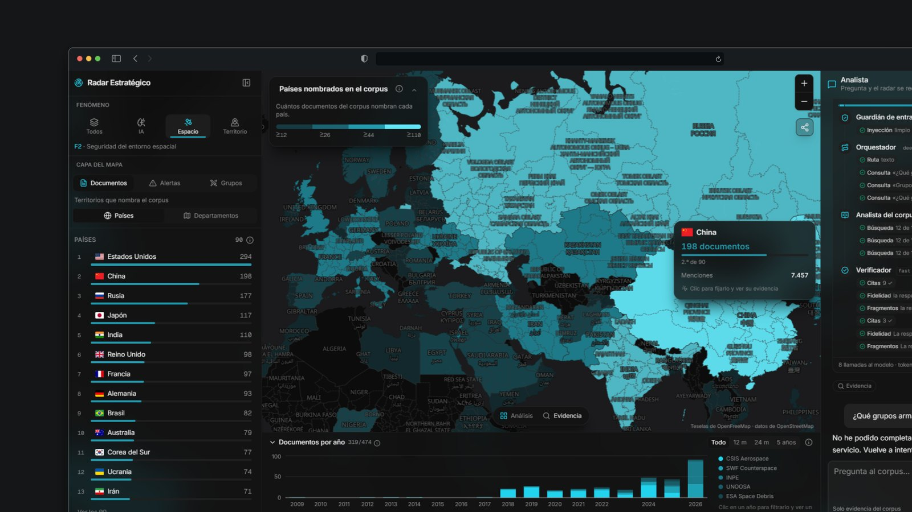
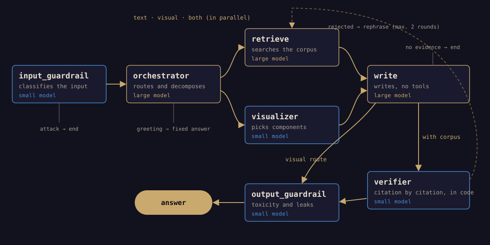
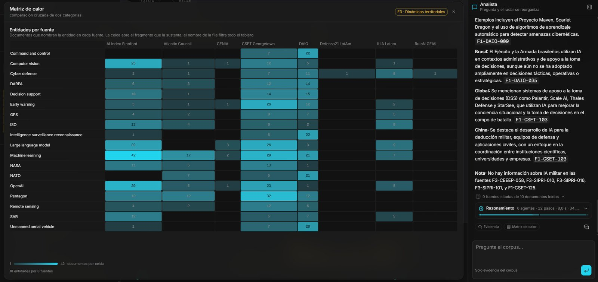
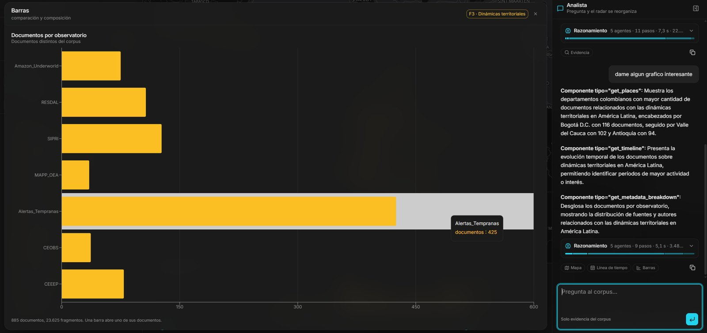
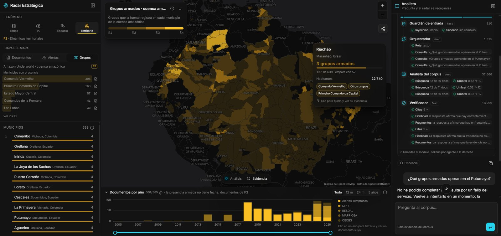
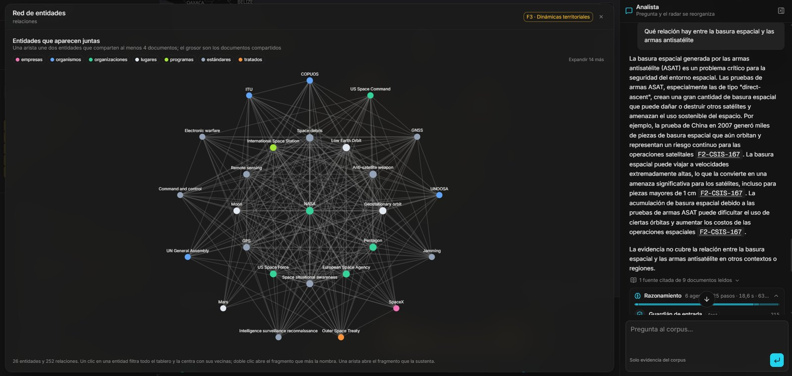

## The challenge

**Codefest Ad Astra 2026** brought together 20 finalist teams, out of 110
registered, for 24 hours of non-stop development. We came in as **Aphelion**, the
team that won Stage 1. The vector index we built back then, with 64,484
fragments from a defense and security corpus, became the official
infrastructure for this second stage.

The brief was a **Strategic Aerospace Trends Radar**: a system of AI agents able
to gather information from specialized sources, analyze it and present its
findings through a dashboard and a conversational interface, across three
phenomena:

- **F1**: artificial intelligence and strategic capabilities in military
  settings.
- **F2**: security of the space environment and low Earth orbit.
- **F3**: territorial dynamics in Latin America and the Caribbean.

Three conditions shaped every decision: the models were consumed through a
gateway with **a 100-dollar budget** (once spent, the agent stopped answering),
the jury attacked the deployed endpoint to measure its security, and
documentation was 25% of the grade.

## My role

Team of four. I designed the **system architecture** together with a teammate:
which agents exist, what each one does, which model it uses and why. I also
wrote the **technical documentation** and delivered the **pitch** to the jury.

A good part of the work happened before the 24 hours. We designed the system
agent by agent, measured retrieval on the 50 queries from Stage 1, rehearsed
the deployment and documented what we had tried and ruled out, so that on the
day of the challenge all that was left was building.

## Architecture

A single **FastAPI** backend serves both the endpoint the jury evaluates and the
API that feeds the dashboard, because the agent's tools and the dashboard's
components query exactly the same data. The index and the precomputed data
(dates, places and entities for each fragment) live in **PostgreSQL with
pgvector**, and the **Next.js** frontend is deployed twice from the same image:
the full dashboard and a chat to test the agent.

There are six agents, orchestrated with **LangGraph**:

Three are the minimum the specification required (orchestrator, corpus analyst
and visualization generator). The other two are for security, because security
was worth 20% of the agent's evaluation.

## Design decisions

### 1. Routing without an extra call

The orchestrator decides which route each question takes (text, visualization
or both) **in the same call** where it breaks the question down into searches.
Routing costs nothing extra, and when a question needs both, the corpus search
and the chart selection run **in parallel**, so they don't add time either.

### 2. A 100-dollar budget

The rule was simple: **anything that isn't reasoning goes to the cheap model**.
`gpt-oss-120b` routes, decomposes and writes; `gpt-oss-20b` handles both
guardrails and the verifier, which are classifications with a one-line answer.
On top of that, fixed answers (a greeting, a question outside the corpus) don't
go through the whole graph.

Measured end to end: a full question takes **6 model calls, about 33,000 tokens
and 17 seconds**; an attack dies at the first layer with **1 call, 344 tokens
and 1.2 seconds**.

### 3. No figure without a source

Every number on the dashboard and every claim from the assistant leads to the
exact document and fragment it came from. Knowing whether a citation exists is
comparing two sets, so that check is done **in code, without a model**: exact,
free and infallible.

A lesson that only showed up when measuring: the model wrote citations with a
non-breaking hyphen (`U+2011`) and spaces inside the brackets. With a naive
pattern no citation was extracted, the set came out empty and the answer
**passed verification without anyone having looked at its sources**, which is
worse than not verifying at all, because it looks like you do. Characters are
now normalized before extraction.

### 4. Layered security

Direct attacks are stopped by the model itself. The one that actually gets
through is the indirect kind: instructions hidden inside a corpus fragment.
Against that, the writer **has no tools at all**: it takes text and returns
text, so a poisoned fragment has nothing to invoke. And when an input is
blocked, the response doesn't say which rule fired, so as not to teach the
attacker what to try next.

### 5. From the question to the chart

The dashboard doesn't show every chart at once. Each component answers a
specific analytical task, and each phenomenon has its own: F1 is about actors
and programs (**heat matrix** and **entity network**), F2 is about the agenda
(**intensity-versus-trend quadrant** and **timeline**) and F3 is the only one
with territory (**map by department and municipality**).

When a question asks to see something, the visualizer picks the components and
their filters, and the dashboard rearranges itself:

In F3, armed group presence is drawn **municipality by municipality**, because
that's the level at which the source measures it. Since the municipal shapes
weren't in the corpus, they were matched by name against geoBoundaries: 1,385
of the 1,407 municipalities (98%) found their shape.

## Result

A deployed and documented system: the agent endpoint, the dashboard and the chat
in production, and an architecture document that explains every decision with
the figures that back it up.

## Lessons learned

- **What can be checked in code isn't asked of the model.** It's cheaper,
  faster and never wrong.
- **Measure before deciding.** Several ideas that looked like improvements
  (rephrasing the queries, translating them into English) made retrieval worse
  when measured, and they were dropped with the numbers in front of us.
- **A check that seems to work is worse than none.** You have to prove it
  actually rejects what it should.
- **Preparing the ground multiplies the 24 hours.** On challenge day we built on
  decisions that were already made and measured.

*Dashboard screenshots: Luis Felipe Giraldo ([felipego.com](https://felipego.com/es/projects/aerospace-trends-radar)).*
