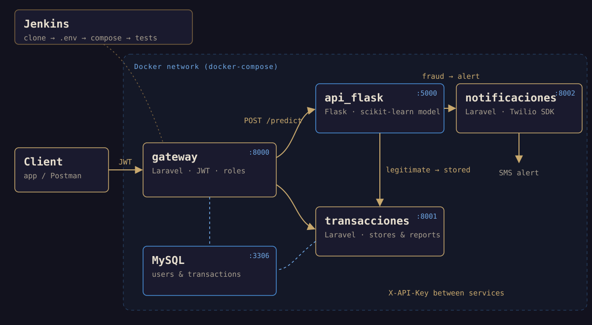

## The problem

Every incoming transaction has to answer one question before it's stored: is it
fraudulent? If not, it's recorded and shows up in the user's and the
administrator's reports. If it is, it isn't stored and an SMS alert goes
out.

The project called for a microservices architecture: small, independent pieces,
each with a single responsibility.

## My role

Team of three. I was in charge of the **gateway** (authentication and roles),
the internal **transactions and notifications services**, the **Docker
orchestration** and part of the **tests**. The machine learning model and its
Flask API were built by another part of the team.

## Architecture



- **gateway** (Laravel): the only way in. It handles sign-up and sign-in with
  JWT, checks the role (`admin` or `user`) and forwards each request to the
  right service.
- **api_flask**: receives the transaction and evaluates it with a scikit-learn
  model.
- **transacciones** (Laravel): stores legitimate transactions and produces the
  per-user and overall reports.
- **notificaciones** (Laravel): sends the SMS alert with the Twilio SDK.
- **MySQL**: users, roles and transactions.

## Technical challenges

### 1. A single way in

Nobody talks to the internal services directly: everything goes through the
gateway, which decides what each role can do. A user checks their transactions
and reports and submits transactions for evaluation; an administrator sees
everything and can delete:

```php
Route::post('login', [AuthController::class, 'login']);
Route::post('register', [AuthController::class, 'register']);

Route::middleware('auth:api', 'role:admin')->group(function () {
    Route::get('/transactions', [TransactionController::class, 'index']);
    Route::delete('/transactions/{transaction}', [TransactionController::class, 'destroy']);
    Route::get('/adminReport', [TransactionController::class, 'adminReport']);
});

Route::middleware('auth:api', 'role:user')->group(function () {
    Route::post('/predict', [FlaskController::class, 'predecirFraude']);
    Route::get('/userstransactions', [TransactionController::class, 'show']);
    Route::get('/userReport', [TransactionController::class, 'userReport']);
});
```

### 2. Trust between services

If the internal services accepted any request, the gateway would be pointless.
Each one requires a shared API key in the `X-API-Key` header, which the gateway
adds when forwarding:

```php
// In the gateway
$response = Http::withHeaders(['X-API-Key' => $this->apiKey])->get($url);
```

```php
// In the transactions service
public function handle(Request $request, Closure $next): Response
{
    if ($request->header('X-API-key') !== env('API_KEY')) {
        return response()->json(['message' => 'Acceso Denegado'], 403);
    }
    return $next($request);
}
```

The gateway also validates the transaction before forwarding it (the 28 numeric
features the model expects plus the amount), so the model never receives
incomplete data.

### 3. The path of a transaction

1. The user sends the transaction to `POST /predict` with their JWT.
2. The gateway validates the data and forwards it to Flask along with the
   user's id.
3. The model classifies it. If it's **legitimate**, Flask sends it to the
   transactions service, which stores it. If it's **fraudulent**, it calls the
   notifications service, which sends the SMS.

Each service only knows the ones it needs, and they all find each other by name
inside the Docker network (`http://transacciones:8000`).

### 4. Everything up with one command

The four services and the database start with `docker-compose`. The three
Laravel services share a single `Dockerfile` (PHP 8.1 with Composer), and the
gateway container prepares the database on startup (migrations and seed data).

On top of that, a **Jenkins** pipeline automates the cycle: it clones the
repository, drops each service's `.env` in place from the credentials stored in
Jenkins (secrets don't live in the code), builds the containers and runs the
gateway's tests inside its container:

```groovy
stage('Construir contenedores') {
    steps { sh 'docker-compose up -d --build' }
}
stage('Tests - Gateway en contenedor') {
    steps { sh 'docker exec gateway php artisan test' }
}
```

### 5. Tests

The gateway has feature tests for sign-in, role checks, reports and
transaction registration. One of them checks something that's easy to take for
granted: that the password is never stored in plain text.

```php
public function test_Encryptation_Password(): void
{
    $response = $this->post('api/register', [
        'name' => 'John Doe',
        'email' => 'johndoe@example.com',
        'password' => 'secret123',
    ]);

    $user = User::find($response->json('user.id'));
    $this->assertNotEquals('secret123', $user->password);
    $this->assertTrue(Hash::check('secret123', $user->password));
}
```

## Result

A system where each piece can change without touching the others: the Flask
model could be retrained or replaced without the gateway noticing, and the whole
environment is rebuilt and tested automatically.

## Lessons learned

- **A gateway simplifies security.** Authentication and roles are handled in one
  place, and internal services only have to trust it.
- **Secrets stay out of the repository.** Injecting each `.env` from Jenkins
  credentials keeps keys out of the code.
- **Docker makes a distributed system reproducible.** Five containers that start
  the same way on any machine are worth more than an installation guide.
