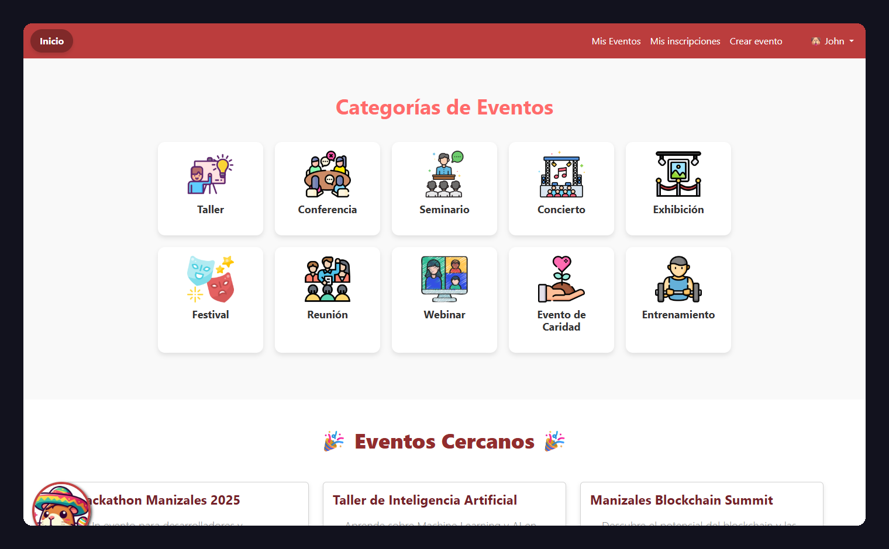
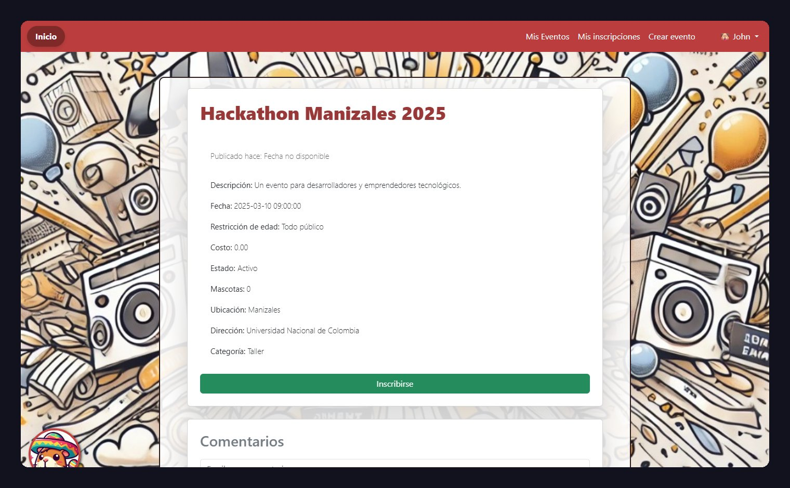
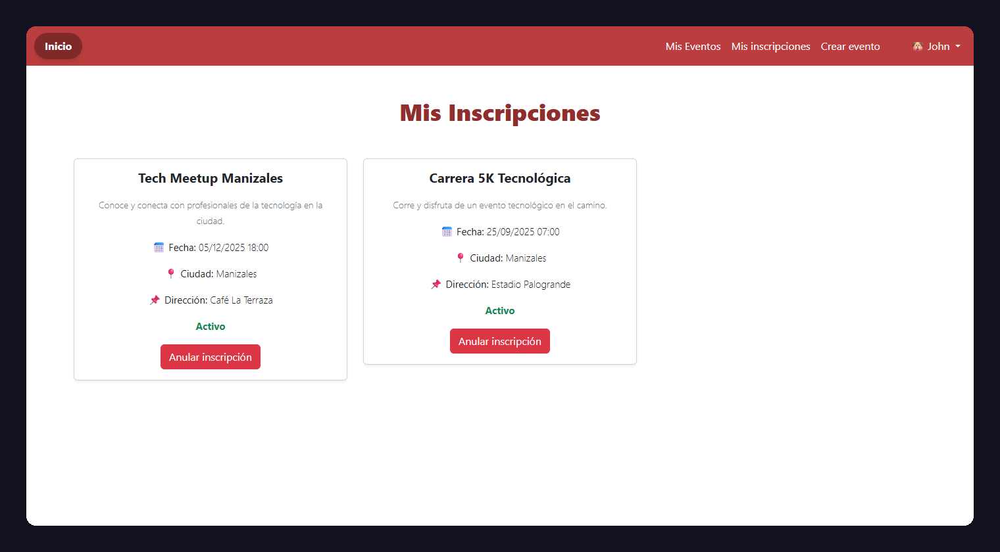

## The problem

A city's events (workshops, concerts, meetups, fairs) tend to be scattered
across social networks and chat groups. Juntalia brings them together in one
place: anyone can publish an event, sign up, comment and, above all, see what's
happening near them.

## My role

Team of three. I was in charge of the **Blade interface** (the public page, the
home page, each event's detail page and the personal sections) and the **events
and sign-ups module**: creating, editing and deleting your own events, signing
up and cancelling. The admin panel, the reports and the React version of the
users panel were built by my teammates.

## Architecture

A classic Laravel 10 application with Blade views:

- **Models**: events, sign-ups, comments, categories, cities, media, users and
  roles.
- **Roles**: users publish and sign up; the administrator manages users, cities
  and events and generates reports.
- **Every event stores its location** (latitude and longitude), which is what
  makes nearby search possible.


## Technical challenges

### 1. Events near you

The "Nearby events" section on the home page uses the browser's location. Once
the user grants permission, the page asks the server for the events close to
those coordinates:

```js
navigator.geolocation.getCurrentPosition(function (position) {
  const { latitude: lat, longitude: lng } = position.coords
  fetch(`/eventos-cercanos?lat=${lat}&lng=${lng}`)
    .then(response => response.json())
    .then(data => mostrarEventos(data))
})
```

On the server, the distance is computed with the **Haversine formula** right
in the SQL query, and only events within 10 km are returned, sorted from
nearest to farthest:

```php
$events = Event::selectRaw("
        *,
        (6371 * acos(
            cos(radians(?)) * cos(radians(lat)) *
            cos(radians(lng) - radians(?)) +
            sin(radians(?)) * sin(radians(lat))
        )) AS distancia", [$latitud, $longitud, $latitud])
    ->having('distancia', '<', 10)
    ->orderBy('distancia')
    ->get();
```

The 6371 is the Earth's radius in kilometers: the formula measures distance
over the surface of a sphere, not in a straight line on a flat map.



### 2. Sign-ups without duplicates

Signing up is one click, which also makes it easy to do twice. Before creating
the sign-up, the code checks that both the user and the event exist and that
there's no previous sign-up:

```php
$request->validate([
    'user_id' => 'required|exists:users,id',
    'event_id' => 'required|exists:events,id',
]);

$existing = Inscription::where('user_id', $request->user_id)
    ->where('event_id', $request->event_id)
    ->first();

if ($existing) {
    return redirect()->back()->with('error', 'Ya estás inscrito en este evento.');
}
```

### 3. An interface for every moment

Each screen answers one of the user's questions: what's on? (categories and
nearby events), what's it about? (detail with date, cost, age restriction,
address and comments), what am I going to? ("My sign-ups") and what did I
publish? ("My events", with editing and deletion).



## Result

A platform that works end to end: publish an event, find it by category or by
distance, sign up, comment on it and manage it from the personal sections.



## Lessons learned

- **Geolocation is best solved in the database.** Computing distance in SQL
  avoids pulling every event into PHP just to filter it.
- **Uniqueness rules are worth enforcing in the database too.** The check in
  the controller works, and a unique index on `(user_id, event_id)` would make
  it airtight even against two simultaneous clicks.
- **Designing around the user's questions organizes the interface.** Each view
  has a clear purpose and doesn't compete with the others.
