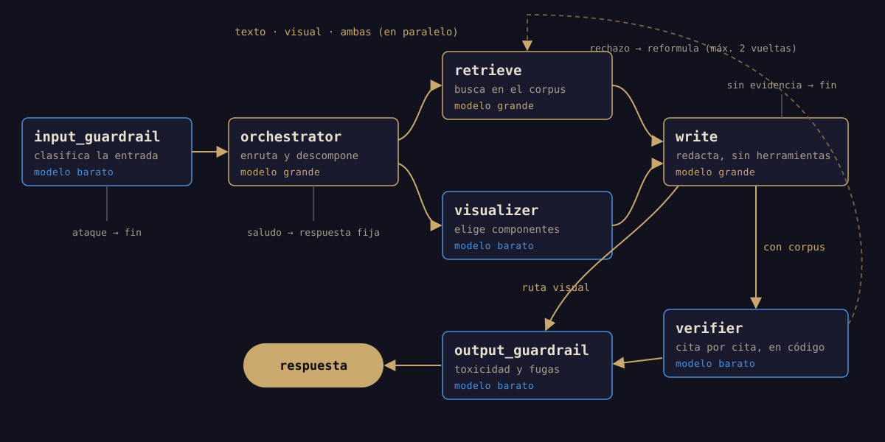

## El reto

El **Codefest Ad Astra 2026** reunió a 20 equipos finalistas, de 110 inscritos,
para 24 horas continuas de desarrollo. Llegamos como **Aphelion**, el equipo que
ganó la Etapa 1. El índice vectorial que construimos entonces, con 64.484
fragmentos de un corpus de defensa y seguridad, se convirtió en la
infraestructura oficial de esta segunda etapa.

El encargo era un **Radar Estratégico de Tendencias Aeroespaciales**: un sistema
de agentes de IA capaz de recopilar información de fuentes especializadas,
analizarla y presentar sus hallazgos en un tablero y en una interfaz
conversacional, sobre tres fenómenos:

- **F1**: inteligencia artificial y capacidades estratégicas en entornos
  militares.
- **F2**: seguridad del entorno espacial y órbita baja.
- **F3**: dinámicas territoriales en América Latina y el Caribe.

Con tres condiciones que marcaron cada decisión: los modelos se consumían a
través de un gateway con **un presupuesto de 100 dólares** (si se agotaba, el
agente dejaba de responder), el jurado atacaba el endpoint desplegado para medir
su seguridad y la documentación pesaba el 25% de la nota.

## Mi rol

Equipo de cuatro personas. Diseñé la **arquitectura del sistema** junto a otro
compañero: qué agentes existen, qué hace cada uno, qué modelo usa y por qué.
También escribí la **documentación técnica** y presenté el **pitch** ante el
jurado.

Buena parte del trabajo se hizo antes de las 24 horas. Diseñamos el sistema
agente por agente, medimos la recuperación sobre las 50 consultas de la Etapa 1,
ensayamos el despliegue y dejamos documentado lo que habíamos probado y
descartado, para que el día del reto solo hubiera que construir.

## Arquitectura

Un solo backend en **FastAPI** atiende a la vez el endpoint que evalúa el jurado
y la API que alimenta el tablero, porque las herramientas del agente y los
componentes del tablero consultan exactamente los mismos datos. El índice y los
datos precalculados (fechas, lugares y entidades de cada fragmento) viven en
**PostgreSQL con pgvector**, y el frontend en **Next.js** se despliega dos veces
desde la misma imagen: el tablero completo y un chat para probar el agente.

Los agentes son seis, orquestados con **LangGraph**:

Tres son el mínimo que pedía la especificación (orquestador, analista del corpus
y generador de visualizaciones). Los otros dos son de seguridad, porque la
seguridad valía el 20% de la evaluación del agente.

## Decisiones de diseño

### 1. Enrutar sin gastar una llamada extra

El orquestador decide qué ruta toma cada pregunta (texto, visualización o ambas)
**en la misma llamada** en la que descompone la pregunta en búsquedas. Enrutar no
cuesta nada adicional, y cuando una pregunta necesita las dos cosas, la
búsqueda en el corpus y la elección de gráficos corren **en paralelo**, así que
tampoco suman tiempo.

### 2. Un presupuesto de 100 dólares

La regla fue simple: **todo lo que no sea razonar va al modelo barato**.
`gpt-oss-120b` enruta, descompone y redacta; `gpt-oss-20b` hace los dos
guardianes y el verificador, que son clasificaciones con una respuesta de una
línea. Además, las respuestas fijas (un saludo, una pregunta ajena al corpus) no
recorren el grafo completo.

Medido de punta a punta: una pregunta completa son **6 llamadas a modelo,
unos 33.000 tokens y 17 segundos**; un ataque muere en la primera capa con
**1 llamada, 344 tokens y 1,2 segundos**.

### 3. Ninguna cifra sin fuente

Cada número del tablero y cada afirmación del asistente llevan al documento y al
fragmento exactos de donde salieron. Saber si una cita existe es comparar dos
conjuntos, así que esa comprobación se hace **en código, sin modelo**: exacta,
gratis y sin fallos.

Una lección que solo apareció al medir: el modelo escribía las citas con un
guion no separable (`U+2011`) y espacios dentro de los corchetes. Con un patrón
ingenuo no se extraía ninguna cita, el conjunto salía vacío y la respuesta
**pasaba la verificación sin que nadie hubiera mirado sus fuentes**, lo cual es
peor que no verificar, porque parece que sí se hace. Se normalizan los
caracteres antes de extraer.

### 4. Seguridad por capas

Los ataques directos los frena el propio modelo. El que de verdad pasa es el
indirecto: instrucciones escondidas dentro de un fragmento del corpus. Contra
eso, el redactor **no tiene ninguna herramienta**: recibe texto y devuelve
texto, así que un fragmento envenenado no tiene nada que invocar. Y cuando se
bloquea una entrada, la respuesta no dice qué regla saltó, para no enseñarle al
atacante cuál es el siguiente intento.

### 5. De la pregunta al gráfico

El tablero no muestra todos los gráficos a la vez. Cada componente responde a
una tarea analítica concreta, y cada fenómeno tiene los suyos: F1 es de actores
y programas (**matriz de calor** y **red de entidades**), F2 es de agenda
(**cuadrante de intensidad contra tendencia** y **línea de tiempo**) y F3 es el
único con territorio (**mapa por departamentos y municipios**).

Cuando una pregunta pide ver algo, el visualizador elige los componentes y sus
filtros, y el tablero se reorganiza solo:

En F3, la presencia de grupos armados se pinta **municipio por municipio**,
porque es el nivel en el que la fuente la mide. Como las geometrías municipales
no venían en el corpus, se cruzaron por nombre con geoBoundaries: 1.385 de los
1.407 municipios (98%) encontraron su forma.

## Resultado

Un sistema desplegado y documentado: el endpoint del agente, el tablero y el
chat en producción, y un documento de arquitectura que explica cada decisión con
las cifras que la respaldan.

## Aprendizajes

- **Lo que se puede comprobar en código no se le pregunta al modelo.** Es más
  barato, más rápido y no se equivoca.
- **Medir antes de decidir.** Varias ideas que parecían mejoras (reformular las
  consultas, traducirlas al inglés) empeoraban la recuperación al medirlas, y se
  descartaron con las cifras delante.
- **Una verificación que parece funcionar es peor que ninguna.** Hay que probar
  que de verdad rechaza lo que debe rechazar.
- **Preparar el terreno multiplica las 24 horas.** El día del reto se construyó
  sobre decisiones ya tomadas y medidas.

*Capturas del tablero: Luis Felipe Giraldo ([felipego.com](https://felipego.com/es/projects/aerospace-trends-radar)).*
