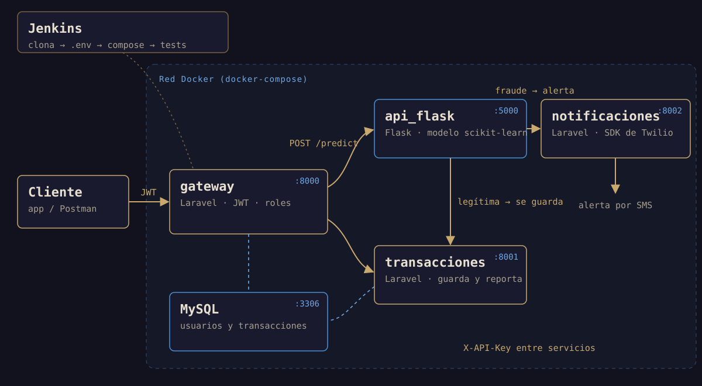

## El problema

Cada transacción que llega tiene que pasar por una pregunta antes de guardarse:
¿es fraudulenta? Si no lo es, se registra y aparece en los reportes del usuario
y del administrador. Si lo es, no se guarda y se envía una alerta por
SMS.

El proyecto pedía resolverlo con una arquitectura de microservicios: piezas
pequeñas e independientes, cada una con una sola responsabilidad.

## Mi rol

Equipo de tres personas. Me encargué del **gateway** (autenticación y roles),
de los **servicios internos** de transacciones y notificaciones, de la
**orquestación con Docker** y de parte de las **pruebas**. El modelo de machine
learning y su API en Flask los hizo otra parte del equipo.

## Arquitectura



- **gateway** (Laravel): la única puerta de entrada. Registra e inicia sesión
  con JWT, verifica el rol (`admin` o `user`) y reenvía cada petición al
  servicio que corresponde.
- **api_flask**: recibe la transacción y la evalúa con un modelo de
  scikit-learn.
- **transacciones** (Laravel): guarda las transacciones legítimas y genera los
  reportes por usuario y generales.
- **notificaciones** (Laravel): envía el SMS de alerta con el SDK de Twilio.
- **MySQL**: usuarios, roles y transacciones.

## Retos técnicos

### 1. Una sola puerta de entrada

Nadie habla directamente con los servicios internos: todo pasa por el gateway,
que decide qué puede hacer cada rol. El usuario consulta sus transacciones y
reportes y envía transacciones a evaluar; el administrador ve todo y puede
borrar:

```php
Route::post('login', [AuthController::class, 'login']);
Route::post('register', [AuthController::class, 'register']);

Route::middleware('auth:api', 'role:admin')->group(function () {
    Route::get('/transactions', [TransactionController::class, 'index']);
    Route::delete('/transactions/{transaction}', [TransactionController::class, 'destroy']);
    Route::get('/adminReport', [TransactionController::class, 'adminReport']);
});

Route::middleware('auth:api', 'role:user')->group(function () {
    Route::post('/predict', [FlaskController::class, 'predecirFraude']);
    Route::get('/userstransactions', [TransactionController::class, 'show']);
    Route::get('/userReport', [TransactionController::class, 'userReport']);
});
```

### 2. Confianza entre servicios

Si los servicios internos aceptaran cualquier petición, el gateway no serviría
de nada. Cada uno exige una API key compartida en la cabecera `X-API-Key`, que
el gateway agrega al reenviar:

```php
// En el gateway
$response = Http::withHeaders(['X-API-Key' => $this->apiKey])->get($url);
```

```php
// En el servicio de transacciones
public function handle(Request $request, Closure $next): Response
{
    if ($request->header('X-API-key') !== env('API_KEY')) {
        return response()->json(['message' => 'Acceso Denegado'], 403);
    }
    return $next($request);
}
```

El gateway, además, valida la transacción antes de reenviarla (las 28
características numéricas que espera el modelo más el monto), así que al modelo
nunca le llegan datos incompletos.

### 3. El camino de una transacción

1. El usuario envía la transacción a `POST /predict` con su JWT.
2. El gateway valida los datos y los reenvía a Flask junto con el id del
   usuario.
3. El modelo la clasifica. Si es **legítima**, Flask la envía al servicio de
   transacciones, que la guarda. Si es **fraudulenta**, llama al servicio de
   notificaciones, que manda el SMS.

Cada servicio solo conoce a los que necesita, y todos se encuentran por su
nombre dentro de la red de Docker (`http://transacciones:8000`).

### 4. Todo arriba con un comando

Los cuatro servicios y la base de datos se levantan con `docker-compose`. Los
tres servicios de Laravel comparten un mismo `Dockerfile` (PHP 8.1 con
Composer), y el contenedor del gateway prepara la base de datos al arrancar
(migraciones y datos iniciales).

Encima de eso, un pipeline de **Jenkins** automatiza el ciclo: clona el
repositorio, pone el `.env` de cada servicio desde las credenciales guardadas en
Jenkins (los secretos no viven en el código), construye los contenedores y corre
las pruebas del gateway dentro de su contenedor:

```groovy
stage('Construir contenedores') {
    steps { sh 'docker-compose up -d --build' }
}
stage('Tests - Gateway en contenedor') {
    steps { sh 'docker exec gateway php artisan test' }
}
```

### 5. Pruebas

El gateway tiene pruebas de feature para el inicio de sesión, la verificación de
roles, los reportes y el registro de transacciones. Una de ellas comprueba algo
que es fácil dar por hecho: que la contraseña nunca se guarda en texto plano.

```php
public function test_Encryptation_Password(): void
{
    $response = $this->post('api/register', [
        'name' => 'John Doe',
        'email' => 'johndoe@example.com',
        'password' => 'secret123',
    ]);

    $user = User::find($response->json('user.id'));
    $this->assertNotEquals('secret123', $user->password);
    $this->assertTrue(Hash::check('secret123', $user->password));
}
```

## Resultado

Un sistema donde cada pieza se puede cambiar sin tocar las demás: el modelo de
Flask podría reentrenarse o reemplazarse sin que el gateway se entere, y todo el
entorno se reconstruye y se prueba de forma automática.

## Aprendizajes

- **Un gateway simplifica la seguridad.** La autenticación y los roles se
  resuelven en un solo lugar, y los servicios internos solo tienen que confiar
  en él.
- **Los secretos van fuera del repositorio.** Inyectar el `.env` desde las
  credenciales de Jenkins mantiene las llaves fuera del código.
- **Docker vuelve reproducible un sistema distribuido.** Cinco contenedores que
  se levantan igual en cualquier máquina valen más que una guía de instalación.
