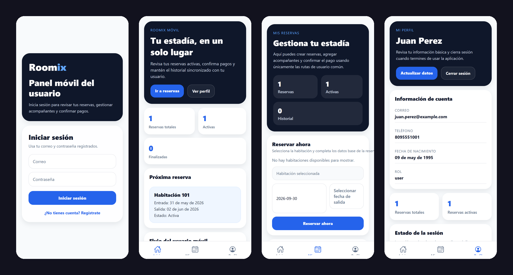
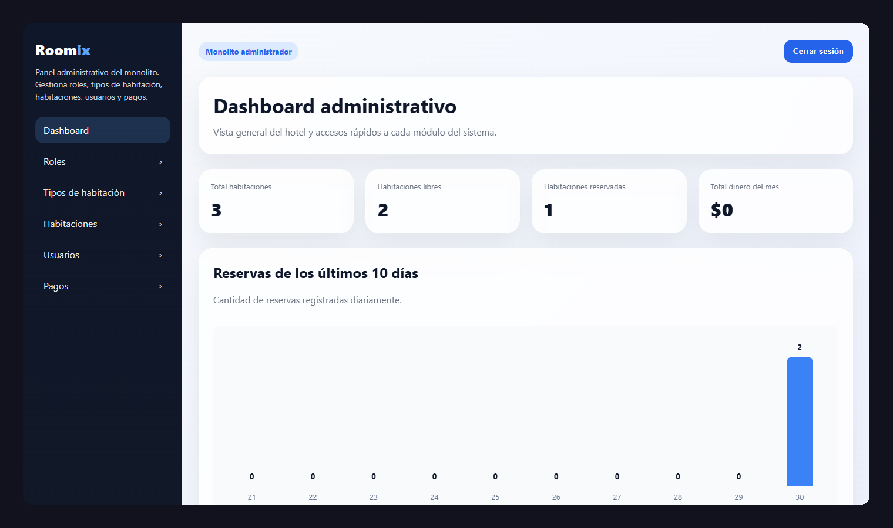

## El problema

Un hotel necesita dos cosas distintas del mismo sistema. Sus huéspedes quieren
reservar desde el celular, ver sus estadías y confirmar pagos. El personal
quiere administrar habitaciones, tipos de habitación, usuarios y pagos sin
pelearse con la base de datos.

Roomix resuelve ambas con un solo backend: una API para la app móvil y un panel
web para la administración.

## Mi rol

Proyecto individual: diseño de la base de datos, API, panel de administración y
app móvil.

## Arquitectura

- **Backend en Laravel 10** con MySQL. Expone una API REST bajo `/api` y, en el
  mismo proyecto, un panel de administración en Blade bajo `/admin`.
- **Autenticación con JWT** (`tymon/jwt-auth`) para la app, y sesión clásica
  para el panel.
- **Roles**: un middleware `role:admin` separa lo que puede hacer el huésped de
  lo que solo puede hacer el administrador.
- **App móvil en React Native con Expo**: navegación por pestañas, un contexto
  de autenticación y un cliente `axios` que adjunta el token en cada petición.



## Retos técnicos

### 1. Que dos reservas no se crucen

La regla más importante del sistema: una habitación no puede reservarse dos
veces para las mismas fechas, y un huésped no puede tener dos reservas activas
que se crucen. Las dos validaciones viven en el servidor, no en la app:

```php
private function hasOverlappingReservation(int $roomId, string $checkIn, string $checkOut): bool
{
    return Reservation::query()
        ->where('room_id', $roomId)
        ->where(function ($query) use ($checkIn, $checkOut) {
            $query->whereBetween('check_in', [$checkIn, $checkOut])
                ->orWhereBetween('check_out', [$checkIn, $checkOut])
                ->orWhere(fn ($q) => $q->where('check_in', '<=', $checkIn)
                                        ->where('check_out', '>=', $checkOut));
        })
        ->exists();
}
```

Si pasa las validaciones, la reserva se crea dentro de una transacción junto con
el cambio de estado de la habitación. Así nunca queda una reserva creada con la
habitación marcada como disponible, o al revés:

```php
DB::beginTransaction();
$reservation = Reservation::create([...]);
$room->update(['status' => 'ocupada']);
DB::commit();
```

El total también lo calcula el servidor (noches × precio de la habitación), así
que la app no puede mandar un precio distinto.

### 2. Quién puede hacer qué

Las rutas de la API se dividen en dos grupos. El huésped autenticado puede ver
habitaciones, gestionar sus reservas y acompañantes y registrar pagos; el resto
del CRUD (roles, tipos de habitación, habitaciones, usuarios y gestión de pagos)
exige además el rol de administrador:

```php
Route::middleware('auth:api')->group(function () {
    Route::get('rooms', [RoomController::class, 'index']);
    Route::apiResource('reservations', ReservationController::class);
    Route::post('payments', [PaymentController::class, 'store']);
});

Route::middleware(['auth:api', 'role:admin'])->group(function () {
    Route::apiResource('rooms', RoomController::class);
    Route::apiResource('users', UserController::class);
});
```

Y al consultar o editar una reserva se verifica que sea del usuario que la pide:
un token válido no basta para ver las reservas de otro.

### 3. Saber quién cambió qué

Las reservas, los pagos, las habitaciones y los usuarios usan
[laravel-auditing](https://github.com/owen-it/laravel-auditing): cada creación,
edición o borrado queda registrado con el usuario que lo hizo y los valores
anteriores. En un sistema que maneja pagos, ese historial es lo primero que se
necesita cuando algo no cuadra.

### 4. La app hablando con el backend

En desarrollo, la app corre en un emulador o en el celular, y `localhost` no
significa lo mismo en cada lugar: en el emulador de Android el computador es
`10.0.2.2`. El cliente HTTP resuelve la dirección del backend a partir del host
de Expo y agrega el token guardado a cada petición:

```js
api.interceptors.request.use(async (config) => {
  const token = await AsyncStorage.getItem('token')
  if (token) config.headers.Authorization = `Bearer ${token}`
  return config
})
```

Al abrir la app, el contexto de autenticación lee el token guardado y pide el
usuario actual; si el token ya no sirve, lo borra y manda al inicio de sesión.

## Resultado

Un sistema completo: el huésped reserva y sigue su estadía desde la app, y el
administrador gestiona todo desde un panel web con indicadores del hotel.



## Aprendizajes

- **Las reglas de negocio van en el servidor.** La app puede validar para dar
  una mejor experiencia, pero quien decide si una reserva es válida es la API.
- **Las transacciones evitan estados imposibles.** Reserva y estado de la
  habitación cambian juntos o no cambian.
- **Un mismo backend puede servir a dos públicos** si la autorización está bien
  separada desde las rutas.
